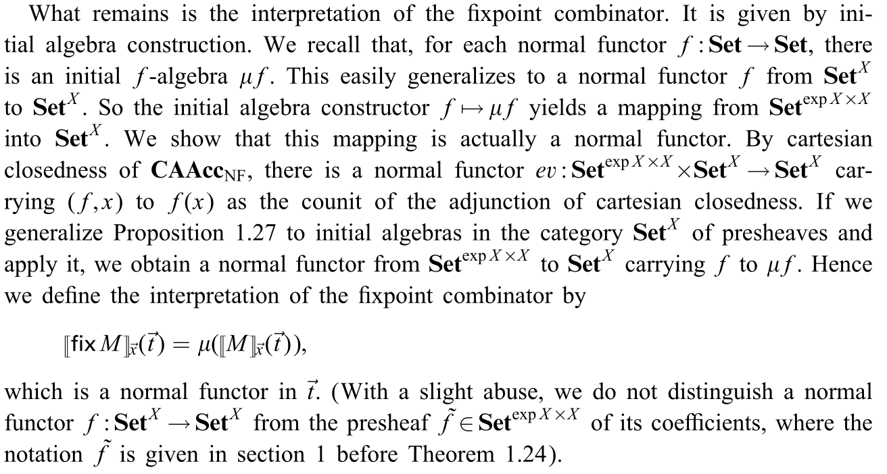

One of the many ways of formally describing a programming language is via *denotational semantics*, in which a term $T$ of type $\tau$ is represented by a mathematical object $\llbracket T \rrbracket \in \llbracket\tau\rrbracket$ (its *denotation*), where $\llbracket\tau\rrbracket$ is a *domain*, a certain kind of structured set. Terms of type $\sigma\to\tau$ are then interpreted as suitable functions $\llbracket\sigma\rrbracket\to\llbracket\tau\rrbracket$ between domains.[^1]

(Thanks to [dpl0a](https://dpl0a.github.io) for having written this introduction replacing my lazy fat fingers.)

In this sense, a certain subcategory of the category of analytic functors (the category of normal functors) is a denotational semantics for a certain flavour of $\lambda$-calculus.

**Definition** (Analytic functor in more than one variable). Let $A$ be a set and $F : \mathbf{Set}^A \to \mathbf{Set}$ a functor ($\mathbf{Set}^A$ is equivalently the product category $\prod_{a\in A}\mathbf{Set}$ and the slice category $\mathbf{Set}/A$; we will make constant use of this equivalence).

We define an *analytic functor in $A$ variables* as a functor $F$ that results from the left Kan extension of a *species in $A$ variables* along the obvious functor $\mathbf{B}^A =\prod_{a\in A}\mathbf{B}\to \mathbf{Set}^A$;

[diag]

Given two sets $A$ and $B$, we define an analytic functor $\mathbf{Set}^A \to \mathbf{Set}^B$ as a $B$-indexed family of analytic functors $F_b : \mathbf{Set}^A \to \mathbf{Set}$; this is motivated by the chain of isomorphisms

$$ \textstyle \mathsf{Cat}(\mathbf{Set}^A,\mathbf{Set}^B) \cong \mathsf{Cat}(\mathbf{Set}^A \times B,\mathbf{Set}) \cong \prod_{b\in B}\mathsf{Cat}(\mathbf{Set}^A,\mathbf{Set})$$

so every property asked to a functor $\mathbf{Set}^A \to \mathbf{Set}^B$ boils down to a property asked to a $B$-indexed family of functors $\mathbf{Set}^A \to \mathbf{Set}$.

**Definition** (The category of normal analytic functors). A functor $F : \mathbf{Set}^A \to \mathbf{Set}$ is called *normal analytic* if it is analytic and results as a coproduct of representables over finitely presentable objects of $\mathbf{Set}^A$; this means that there exists a canonical way to decompose $F$ as $\sum_{i\in I} \mathbf{Set}^A(X_i,-)$, where $X_i$ is a finite set for every $i\in I$ (while there is no restriction on the cardinality of $I$).

A NAF $\mathbf{Set}^A \to \mathbf{Set}^B$ is defined as a $B$-indexed family of NAFs $F_b : \mathbf{Set}^A \to \mathbf{Set}$. We define the category $\mathsf{NAF}$ of normal analytic functors having

- objects the categories $\mathbf{Set}^A, \mathbf{Set}^B,\dots$;
- morphisms the NAFs $\mathbf{Set}^A \to \mathbf{Set}^B$.

This can be promoted to a 2-category taking natural transformations between NAFs as 2-cells, but the choice of which transformations are admissible, in the sense that they preserve analiticity, is a subtle issue. In order for some results to be true, the class of transformations $F \Rightarrow G$ between two NAFs has to be restricted (taking for example only the *cartesian* natural transformations), collapsed (identifying two natural transformations under a certain equivalence relation), or both.

Now, let's observe that there is an alternative description of NAFs as "the opposite category of sets" up to equivalence; this result is rooted in a rather deep variety theorem for categories generated under coproducts.

A *complete atomic accessible category* is a category $\mathcal C$ with finite limits and small
coproducts that are disjoint and universal, C being subject to the condition
that

(i) the lattice Sub(1) of the subobjects of a terminal object 1 is small, and
(ii) every object is a coproduct of atomic elements ("atoms" for short) in the lattice Sub(1). From this it follows that the lattice Sub(1) is a complete atomic Boolean algebra.

This is sufficient to see that a CAAC $\mathcal C$ is equivalent to the free coproduct completion of its set of atoms $A(\mathcal C)$. Since for a discrete category the coproduct completion coincides with the free cocompletion, the canonical functor $\mathcal{C} \to \mathbf{Set}^{A(\mathcal C)}$ is an equivalence if and only if $\mathcal C$ is a CAAC.

This is sufficient to deduce

**Theorem** (NAF as $\mathbf{Set}^\text{op}$). There is an equivalence of categories between $\mathsf{CAAC}$ and $\mathbf{Set}^\text{op}$, determined identifying a set $A$ with its presheaf category, and a CAAC with the set/lattice of its atoms.

In particular, the category of CAACs is cartesian closed:

**Theorem** (Cartesian closure of NAAC).

*Proof*.

The $\lambda$-calculus we are interested in is called *PCF*. Like all $\lambda$-calculi, PCF xtends the bare $\lambda$-calculus given by the BNF specification

$$ T ::= x \mid T\, T \mid \lambda x.T  $$

The $\lambda$-calculus we want to study is typed (of course), so we have to specify both types and terms having those types:

For what concerns types,

$$ \sigma ::= \iota \mid o \mid \sigma \Rightarrow\sigma $$

where $\iota$ is regarded as the type of natural numbers, and $o$ as a type of Boolean values. For what concerns terms,

$$
\begin{array}{rcl} M & ::= & x \\
   && \mid M\, M \\
   && \mid \lambda x^\sigma.M \\
   && \mid \text{fix } M \\
   && \mid \text{suc } M \\
   && \mid \text{pred } M \\
   && \mid \text{zero? } M \\
   && \mid \text{if } M \text{ then } M \text{ else } M \\
   && \mid t \\
   && \mid f \\
   && \mid n
   \end{array}
$$

In this list $x$ is a variable from a fixed (unnamed) countable set, $n$ is a natural number, $\text{fix } M$ is the *fixpoint* of a term $M$, $\text{suc}$ and $\text{pred}$ behave like the successor and predecessor functions ver natural numbers, $\text{zero?}$ is a test: it returns $t$ if the number is not equal to zero, and $f$ otherwise (so, obviously, $\{t,f\}$ is a set of truth values). Finally, we have and if-then-else construct.

Thanks to the above theorem we can interpret the category of NAFs as the opposite of the category of sets. Thus, when looking for a denotational semantics for PCF we can interpret types and terms as if they were sets.

In particular, types are interpreted as sets by the following definition:

$$ \begin{array}{c}
\llbracket \iota \rrbracket := \omega \\[.5em]
\llbracket o \rrbracket := \{0,1\} \\[.5em]
\llbracket \sigma \Rightarrow \tau \rrbracket := \exp \llbracket \sigma\rrbracket \times \llbracket \tau\rrbracket \\
\end{array} $$

where $\exp \llbracket \sigma \rrbracket$ is the result of applying the analytic functor of multisets to the object $\llbracket \sigma \rrbracket$.

For the interpretation of a term, we de*ne it on correct typing judgments as

$$ \Gamma = x_1^{\sigma_1}, \dots, x_n^{\sigma_n} \vdash M : \tau $$

The interpretation $\llbracket M \rrbracket_{\vec x}$ is a normal functor $\mathbf{Set}^{A_1+\dots+A_n} \to \mathbf{Set}^B$ where $A_i = \llbracket \sigma_i\rrbracket$ and $B = \llbracket \tau \rrbracket$. This definition is by induction on construction of terms. What is the most interesting is the interpretation of the fixpoint combinator. But we start with easy ones.

We interpret

- $\lambda$ terms as

  $$ \begin{array}{c}
  \llbracket x_i\rrbracket_{\vec x}(\vec t) = t_i \\[.5em]
  \llbracket M\, N\rrbracket_{\vec x}(\vec t) = \text{ev}(\llbracket M\rrbracket_{\vec x}, \llbracket N\rrbracket_{\vec x}) \\[.5em]
  \llbracket \lambda y^\sigma.M\rrbracket_{\vec x}(\vec t) = \Lambda(\llbracket M\rrbracket_{\vec x,y}(\vec t,-))
  \end{array}$$

  where $\text{ev}$ and $\Lambda$ are respectively evaluation and currying of the cartesian closed structure.

- Arithmetic and Boolean operations as

  $$ \begin{array}{c}
  \llbracket t\rrbracket = \{1\}, \qquad \llbracket f\rrbracket = \{0\} \\[.5em]
  \llbracket \text{suc}\rrbracket : [\{n\}, n+1] \mapsto 1 \\[.5em]
  \llbracket \text{pred}\rrbracket : [\{n+1\}, n] \mapsto 1 \\[.5em]
  \llbracket \text{pred}\rrbracket : [\{0\}, 0] \mapsto 1
  \end{array}$$

  and zero otherwise.
- The $\text{zero?}$ test as

  $$ \begin{array}{c}
  \llbracket \text{zero?}\rrbracket : [\{n+1\}, 1] \mapsto 1 \\[.5em]
  \llbracket \text{zero?}\rrbracket : [\{0\}, 0] \mapsto 1 \\[.5em]
  \end{array}$$

  and zero otherwise.

- The if-then-else construct as the functor $\mathbf{Set}^{\exp 2\times \exp A \times \exp A \times A} \to \mathbf{Set}$, sending $(\{1\}, \{a\}, \_, a)$ and $(\{0\}, \_, \{a\}, a)$ to $1$, and assuming the value $\varnothing$ elsewhere.

Finally, the fixpoint operation $\text{fix}$ is interpreted as an initial algebra construction: ...I could transcribe Hasegawa, but what for?

#### Notes

[^1]: As it's common in set theoretical foundations of mathematics, functions enjoy an *extensionality principle* (i.e. are considered equal when they agree on all arguments). Therefore unlike its *operational* counterpart, denotational semantics is more concerned with the *statics* of a program, rather than its *dynamics*.

#### Reading list

- Hasegawa, Ryu. _Two applications of analytic functors._ Theoretical Computer Science 272.1-2 (2002): 113-175.