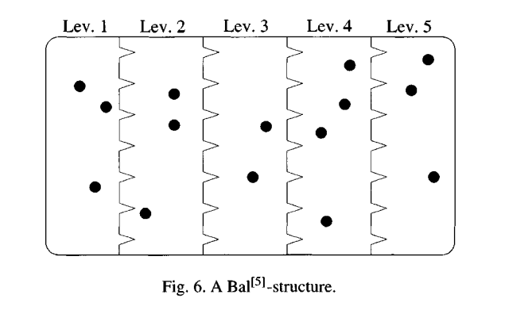

An operad is a monoid for the substitution product discussed in [lecture 3](./3-monoidal-structures-on-P.html#defi-5). As such, "the theory of operads" is the study of the category $\mathbf{Opd}={\bf Mon}({\bf Spc},\circ)$; but things are never as simple as they seem...

First, let's flesh out what the definition prescribes. An *operad* consists of a functor $T : {\bf B} \to \bf Set$, equipped with

- multiplication, a natural transformation of type $\mu : T \circ T\Rightarrow T$, subject to the associativity axiom (the two compositions are mediated by the associator):

  
  \setlength{\fboxrule}{1sp}
  \setlength{\fboxsep}{0sp}
  \fbox{\xymatrix{
  (T\circ T)\circ T\ar[r]^-{\mu\circ T}\ar[d]_-\wr & T\circ T \ar[dd]^-\mu \\
  T\circ (T\circ T) \ar[d]_-{T\circ\mu}& \\
  T\circ T \ar[r]_-\mu & T
  }}
   

- unit, a natural transformation of type $\eta : J \Rightarrow T$ which satisfies the left and right unit axioms (mediated by the unitors):

  
  \setlength{\fboxrule}{1sp}
  \setlength{\fboxsep}{0sp}
  \fbox{\xymatrix{
  J \circ T\ar[dr]_-\sim\ar[r]^-{\eta\circ T} & \ar[d]_-\mu T\circ T & T\circ J\ar[l]_-{T\circ \eta} \ar[dl]^-\sim\\
  &T&
  }}
  

It is worth noting explicitly the shape of $\mu,\eta$; those who already know it will recognize the form of an operad as defined in, say, algebraic topology textbooks.

- $\eta$, as a natural transformation of type $y1 \Rightarrow T$, corresponds by Yoneda to an element $u\in T1$.
- $\mu$ is a natural transformation in the set

$$ \begin{aligned}
  {\bf Spc}\Big(\int^m Tm\times T^{*m}(-) , T\Big) & \cong \int_m {\bf Spc}\big(Tm\times T^{*m}(-) , T\big)                                                                          \\
                                                   & \cong \int_{mr} {\bf Set}\big(Tm\times T^{*m}r , Tr\big)                                                                        \\
                                                   & \cong \int_{mr, \vec n} {\bf Set}\Big(Tm\times Tn_1\times\dots\times Tn_m \times {\bf B}(\textstyle\sum n_i,r) , Tr\Big)        \\
                                                   & \cong \int_{mr, \vec n} {\bf Set}\Big({\bf B}(\textstyle\sum n_i,r), \\ 
                                                   &\kern6em {\bf Set}(Tm\times Tn_1\times\dots\times Tn_m , Tr)\Big) \\
                                                   & \cong {\bf Set}(Tm\times Tn_1\times\dots\times Tn_m , T(\textstyle\sum n_i))
 \end{aligned} $$

where the last equality is Yoneda, and thus $\mu$ has components


\setlength{\fboxrule}{1sp}
\setlength{\fboxsep}{0sp}
\fbox{\xymatrix{
 \mu : Tm\times Tn_1\times\dots\times Tn_m \ar[r] & T(n_1+\dots + n_m)
}}


**Remark.** Naturality for $\eta$ is straightforward; note that naturality for $\mu$ amounts to the commutativity of the diagram


\setlength{\fboxrule}{1sp}
\setlength{\fboxsep}{0sp}
\fbox{\xymatrix{
 Tm\times Tn_1\times\dots\times Tn_m \ar[r]^-\mu \ar[d]_{T\alpha\times T\beta_1\times\dots\times T\beta_n}& T(n_1+\dots + n_m) \ar[d]^{T\bar\beta}\\
 Tm\times Tn_1\times\dots\times Tn_m \ar[r]_-\mu & T(n_1+\dots + n_m)
}}


given permutations $\alpha, \beta_1,\dots, \beta_m$, where $\bar\beta=\beta_1 \mathbin{ш} \beta_2 \mathbin{ш} \dots \mathbin{ш} \beta_m$ is the shuffle (шафл) of the permutations $\beta_1,\dots, \beta_m$.

Associativity of $\mu$ is better appreciated through a picture: given an $n$-ary term $f\in Tn$, terms $g_1\in Tp_1,\dots,g_n\in Tp_n$, and moreover terms $h_{1,1},\dots, h_{1,q_{p_1}},\dots, h_{n,1},\dots, h_{n,p_n}$, the two graftings depicted below are equal.


\begin{tikzpicture}
 \draw (0,0) pic {vertex={2pt}};
 \draw (.15,0) pic {vertex={2pt}};
 \draw (.39,0) pic {vertex={2pt}};
 \draw (0,-16pt) pic {box={6pt,g_1}};
 \begin{scope}[xshift=1.25cm]
  \draw (0,0) pic {vertex={2pt}};
  \draw (.15,0) pic {vertex={2pt}};
  \draw (.39,0) pic {vertex={2pt}};
  \draw (0,-16pt) pic {box={6pt,g_n}};
 \end{scope}
 \draw (6pt,-.85) -- ++(0,-8pt);
 \draw (41.5pt,-.85) -- ++(0,-8pt);
 \filldraw[fill=white] (0,-1.25) rectangle ++(48pt,8pt) node[pos=.5, font=\tiny] {$f$};
 \begin{scope}[xshift=3cm,yshift=2cm]
  \draw (0.0357,-8.5pt) pic {vertex={2pt}};
  \draw (.105,-8.5pt) pic {vertex={2pt}};
  \draw (.386,-8.5pt) pic {vertex={2pt}};
  \draw (0,-20pt) pic {box={6pt,g_1}};
  \begin{scope}[xshift=1.25cm]
   \draw (0.0357,-8.5pt) pic {vertex={2pt}};
   \draw (.105,-8.5pt) pic {vertex={2pt}};
   \draw (.386,-8.5pt) pic {vertex={2pt}};
   \draw (0,-20pt) pic {box={6pt,g_n}};
  \end{scope}
  \begin{scope}[yshift=-4pt]
   \draw (6pt,-.85) -- ++(0,-8pt);
   \draw (41.5pt,-.85) -- ++(0,-8pt);
   \filldraw[fill=white] (0,-1.25) rectangle ++(48pt,8pt) node[pos=.5, font=\tiny] {$f$};
  \end{scope}
 \end{scope}
 \begin{scope}[xshift=3cm,yshift=-2.5cm]
  \draw (0.0357,-6pt) pic {vertex={2pt}};
  \draw (.105,-6pt) pic {vertex={2pt}};
  \draw (.386,-6pt) pic {vertex={2pt}};
  \draw (0,-20pt) pic {box={6pt,g_1}};
  \begin{scope}[xshift=1.25cm]
   \draw (0.0357,-6pt) pic {vertex={2pt}};
   \draw (.105,-6pt) pic {vertex={2pt}};
   \draw (.386,-6pt) pic {vertex={2pt}};
   \draw (0,-20pt) pic {box={6pt,g_n}};
  \end{scope}
  \draw (6pt,-.85) -- ++(0,-8pt);
  \draw (41.5pt,-.85) -- ++(0,-8pt);
  \filldraw[fill=white] (0,-1.25) rectangle ++(48pt,8pt) node[pos=.5, font=\tiny] {$f$};
 \end{scope}
 \begin{scope}[xshift=6cm]
  \draw (0.0357,-8.5pt) pic {vertex={2pt}};
  \draw (.105,-8.5pt) pic {vertex={2pt}};
  \draw (.386,-8.5pt) pic {vertex={2pt}};
  \draw (0,-20pt) pic {box={6pt,g_1}};
  \begin{scope}[xshift=1.25cm]
   \draw (0.0357,-8.5pt) pic {vertex={2pt}};
   \draw (.105,-8.5pt) pic {vertex={2pt}};
   \draw (.386,-8.5pt) pic {vertex={2pt}};
   \draw (0,-20pt) pic {box={6pt,g_n}};
  \end{scope}
  \draw (6pt,-.85) -- ++(0,-8pt);
  \draw (41.5pt,-.85) -- ++(0,-8pt);
  \filldraw[fill=white] (0,-1.25) rectangle ++(48pt,8pt) node[pos=.5, font=\tiny] {$f$};
 \end{scope}
 \begin{scope}[xshift=3.75cm,yshift=-1cm]
  \node (p1) at ( 0:1cm) {$\bullet$};
  \node (p2) at ( 90:1cm) {$\bullet$};
  \node (p3) at (180:1cm) {$\bullet$};
  \node (p4) at (-90:1cm) {$\bullet$};
  \draw[->] (p2) -- (p1) node[pos=.5, above,font=\tiny] {$\mu$};
  \draw[->] (p3) -- (p2) node[pos=.5, above left=-2mm,font=\tiny] {$\frac{\mu,\dots,\mu}{1}$};
  \draw[->] (p3) -- (p4) node[pos=.5, below left=-2mm,font=\tiny] {$\frac 1\mu$};
  \draw[->] (p4) -- (p1) node[pos=.5, below,font=\tiny] {$\mu$};
 \end{scope}
\end{tikzpicture}


**Proposition.** Every operad $T : {\bf B} \to {\bf Set}$ defines a monad $\flat T : {\bf Set} \to {\bf Set}$ as follows:

- the underlying endofunctor $\flat T$ is

$$ (\flat T)X := \int^n X^n \times Tn $$

evidently, $\flat T$ is the analytic functor associated to $T$, so the construction of this proposition can be summarized as: *the analytic functor associated to an operad* (qua species) *is a monad*, and thus an *analytic* monad.
- the unit (component) $\eta : X \to (\flat T)X$ is defined through the unit of $T$,

  
  \setlength{\fboxrule}{1sp}
  \setlength{\fboxsep}{0sp}
  \fbox{\xymatrix{
  X \cong X\times 1\ar[r]^-{\langle \text{id},\eta\rangle}&
  X^1 \times T1 \ar[r]^-{\text{in}_1} &
  \int^n X^n \times Tn
  }}
  

- the multiplication (component) $\mu : (\flat T)((\flat T)X) \to (\flat T)X$ is defined from the composition

$$ \begin{aligned}
  \int^{m} (M_T(X))^m \times Tm
   & \cong \int^{m} \Bigl[ \int^{n} X^n \times Tn \Bigr]^m \times Tm                                                   \\
   & \cong \int^{m} \left(\int^{\vec n} X^{n_1+\cdots+n_m} \times T{n_1} \times \cdots \times T{n_m} \right) \times Tm \\
   & \cong \int^{m,\vec n} X^{n_1+\cdots+n_m} \times T{n_1} \times \cdots \times T{n_m} \times  Tm                     \\
   & \to \int^k X^k\times Tk
 \end{aligned} $$

where the last arrow is obtained, in turn, composing


\setlength{\fboxrule}{1sp}
\setlength{\fboxsep}{0sp}
\fbox{\xymatrix{
X^{\sum n_i} \times Tm \times T{n_1} \times \cdots \times T{n_m}  \ar[d]_-{\langle\mu,\text{id}\rangle} & \\
X^{\sum n_i} \times T\left(\sum n_i\right)  \ar[r]^-{\text{in}_{k=\sum n_i}} &
\int^k X^k \times Tk
}}


## Examples of operads

As is obvious, on the same set there can be non-isomorphic monoid structures; similarly, even if usually there is just *one* important implicitly understood operad structure on a species, there can be many. One example is the species of linear orders $L$: it is the *associative operad* $As$ operad with respect to a natural composition operation, but it is also an operad $Zinb$, the *Zinbiel* operad, with respect to a different structure.

**Example.** The [species of singletons](./2-p-and-its-up-and-species.html#label-3) defines an operad since its associated analytic functor is the identity (which is a monad, of course!).

**Example.** The [species of elements](./2-p-and-its-up-and-species.html#label-5bis) $J : {\bf B} \to {\bf Set}$ consisting of the inclusion defines an operad *and a cooperad* (i.e. a $\circ$-comonoid in $\bf Spc$); I am recording the proof since it is an interesting piece of work I couldn't find in any reference so far. A formal reason why $J$ must be a cooperad is that the associated analytic functor $\text{Lan}_J J$ must be a comonad: the density comonad of $J$. In fact, establishing an explicit form for $\text{Lan}_J J$ will unravel both structures, so we embark in a

**Remark.** An explicit description for $\text{Lan}_J J$. It is well known that in order to compute $\text{Lan}_J J(X)$ for a set $X$, one has to compute the colimit of $J\circ \pi$ in the diagram 


\setlength{\fboxrule}{1sp}
\setlength{\fboxsep}{0sp}
\fbox{\xymatrix{
(J/X) \drtwocell<\omit>{}\ar[r]^-\pi\ar[d]& {\bf B} \drtwocell<\omit>{}\ar[r]^-J\ar[d]_-J & {\bf Set} \\ 
1\ar[r]_-X  & {\bf Set} \ar@/_1pc/[ur] & 
}}


where the left square is a comma object; furthermore, the colimit of the composite functor $J\circ\pi$ is isomorphic to the set of connected components of its category of elements $\nabla(J\circ\pi)$, thus we are left to compute the latter object. 

An object of $\nabla(J\circ\pi)$ now is a triple $(n,\varphi : n \to X,i\in n)$ (for all practical purposes, this is a pointed $n$-tuple of elements of $X$: thus, $0=\varnothing$ is not an element of $\nabla(J\circ\pi)$), and an arrow $(n,\varphi,i) \to (m,\psi,j)$ is a bijection $\sigma : n \to n$, such that $\sigma i=j$ and $\varphi = \psi\circ\sigma$. All in all, then, two objects of $\nabla(J\circ\pi)$ lie in the same connected component if and only if they define the same nonempty, unordered, pointed list, and $(\text{Lan}\_J J)X$ seems to be isomorphic to the Cartesian product $X\times \mathbb N_+[X]$ where $\mathbb N_+[X]$ is the *free commutative semigroup* on $X$ (its elements are nonempty unordered lists). We know from formal reasons that this has to be a comonad; the structure is given by projection and diagonal maps. Moreover, $\mathbb N_+[X]$ is a monad, the functor $X\mapsto X\times \mathbb N_+[X]$ being the product $\text{id}\times \mathbb N_+[-]$ in the category of monads on $\bf Set$.

**Example.** Every species $P$ defines an operad, the *endomorphism operad*, with carrier $\\{P,P\\}$ (notation as in [the construction of the internal hom for $\circ$](./3-monoidal-structures-on-P.html#dayhom)); the unit is the mate of the left unitor $y(1)\circ P \to P$, and the multiplication is obtained as the mate of the counit of $-\circ P\dashv \\{P,-\\}$:


\setlength{\fboxrule}{1sp}
\setlength{\fboxsep}{0sp}
\fbox{\xymatrix{
\{P,P\}\circ \{P,P\} \circ P \ar[r]^-{\{P,P\}\circ\epsilon} & \{P,P\} \circ P \ar[r]^-\epsilon & P
}}


Associativity and unitality follow from the adjunction identities of $-\circ P\dashv \\{P,-\\}$. In particular, if $P$ is constant at a set $P_0$, one has $\\{P,P\\}(m) = {\bf Set}(P^m_0,P_0)$.

**Example.** There is an operad structure on the [terminal object](./2-p-and-its-up-and-species.html#label-5) $E : n\mapsto\{\ast\}$ of set-species $\bf Spc$, but this is not very interesting (the structure is trivially given by the unique map $E\circ E \to E$, $y(1) \to E$ into $E$). Instead, on [$k$-vector species](./8-species-like-categories.html#sect-3), the operad $\boldsymbol k[E] : n\mapsto \boldsymbol k$ constant at the 1-dimensional space carries the structure of an operad as follows: first, observe that $k[E]\circ k[E] = \int^m k[E]m\otimes k[E]^{\ast m} \cong \int^m k\otimes k[E^{\ast m}]$; this (plus the fact that $k[-]$ is strong monoidal) reduces the problem to the computation of the iterated Day convolution of $E$ with itself. A type of $E^{\ast m}(n)$ structure now consists of a *$m$-partition* on $n$ in the terminology of the red book, i.e. an ordered partition of $n$ into $m$ (possibly empty) disjoint subsets (so: $E^{\ast m}\cong {\bf Set}(-,m)$ with the action of a permutation defined as $f\mapsto f\circ \sigma^{-1}$); $E^{\ast m}$ is called the species $\text{Par}^{[m]}$ of $m$-partitions.

The operad structure is once again obtained simply (but not completely trivially) by setting the multiplication as the map


\setlength{\fboxrule}{1sp}
\setlength{\fboxsep}{0sp}
\fbox{\xymatrix{
k[E](m)\times k[E]n_1\times \dots\times k[E]n_m \ar[r] & k[E]\big(\sum n_i\big)
}}


sending $(\alpha;\beta_1,\dots, \beta_m)$ to $\alpha\beta_1\cdots\beta_m$ (product in $\boldsymbol k$).

The species of *nonempty* sets also carries a structure of (set, and $k$-vector) operad, which in some respect is more interesting; the same reasoning can be repeated, until the characterization of $E_+^{\ast m}$ is due. In the terminology of the red book, a species of $E_+^{\ast m}$-structure on $n$ consists of an $m$-ballot, i.e. an unordered partition into nonempty subsets of $n$. The resulting species is denoted $\text{Bal}^{[k]}$. Here is a picture:

**Example.** The operad $As$ with carrier $L$ is obtained as the "natural" operad structure on $L=\sum_{n\ge 0} y(n)$; the unit is given by the first coprojection $\text{in}\_1 : y(1)\hookrightarrow \sum_{n\ge 0} y(n)$, and since $L\circ L\cong \sum_{n\ge 0} L^{\ast n}$, to define a multiplication $L\circ L\to L$ it is enough to define a map of species $L^{\ast n} \to L$; this can be done to the effect that in components, the multiplication $\mu_{As}$ is defined as


\setlength{\fboxrule}{1sp}
\setlength{\fboxsep}{0sp}
\fbox{\xymatrix{
L(m)\times Ln_1\times \dots\times Ln_m \ar[r] & L\big(\sum n_i\big)
}}


sends $(\sigma ; \tau_1 , \dots, t_m)$ to the shuffle $\tau_{\sigma 1} \mathbin{ш} \dots \mathbin{ш} \tau_{\sigma m}$.

**Example.** A different operad structure (the operad $Zinb$) over $L_+$

**Example.** The $Lie$ operad.

We can summarize the situation in a table:

<table>
<thead>
<tr>
<th>Operad</th>
<th>Carrier</th>
<th></th>
</tr>
</thead>
<tbody>
<tr>
<td align="center">$Com, Com_+$</td>
<td align="center">$E, E_+$</td><td>(terminal, nonempty terminal)</td>
</tr>
<tr>
<td align="center">$As, As_+$</td>
<td align="center">$L, L_+$</td><td>(linear orders, nonempty linear orders)</td>
</tr>
<tr>
<td align="center">$Zinb$</td>
<td align="center">$L_+$</td><td>(nonempty linear orders)</td>
</tr>
<tr>
<td align="center">$Perm$</td>
<td align="center">$J$</td><td>(species of elements)</td>
</tr>
<tr>
<td align="center">$Lie$</td>
<td align="center"></td>
</tr>
</tbody>
</table>

